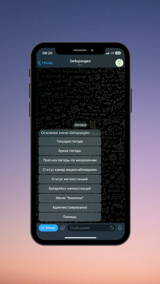

# Geliopaxgeo Telegram Bot


____
### Описание проекта:

Telegram бот Geliopaxgeo предназначен для взаимодействия с **локальной** базой данных Агрохолдинга для 
просмотра данных 
через меню 
бота. Бот также включает в себя возможность отправки **автоматических** уведомлений в случае возникновения 
каких-либо событий или в определенное время.

**В данном проекте используется СУБД PostgreSQL**
____
### Структура проекта:

- dboperator.py - содержит в себе все функции для взаимодействия с базой данных, в моём проекте используется база данных PostgreSQL, 
  но можно адаптировать скрипт под вашу базу изменив диспетчер контекста DBConnector:
```python
#dboperatory.py

import settings
import logging
import psycopg2

logger = logging.getLogger('__name__')
db_config = settings.DB_CONFIG

#   DB_CONFIG = {
#   'host': 'myhost',
#   'user': 'myuser',
#   'password': 'mypassword',
#   'database': 'mydb'
#}


class MyPsycopg2Error(psycopg2.Error):
    """ Кастомный обработчик ошибок Psycopg2"""
    def __init__(self, error):
        self.error = error

    def __str__(self):
        return f"Ошибка: {self.error.pgcode} {self.error.pgerror}"

    
class DBConnector:
    """ Диспетчер контекста для подключения к базе данных.
        Параметры подключения передаются через словарь
    """

    def __init__(self, config_dict: dict) -> None:
        self.configuration = config_dict

    def __enter__(self):
        try:
            self.conn = psycopg2.connect(**self.configuration)
            self.cursor = self.conn.cursor()
            return self.cursor
        except psycopg2.Error as e:
            logger.critical(f'Ошибка при подключении к базе данных. Ошибка: {e}')

    def __exit__(self, exc_type, exc_value, exc_trace) -> None:
        self.conn.commit()
        self.cursor.close()
        self.conn.close()
```
____
- main.py: скрипт, в котором содержится основные функции и классы работы с ботом. Принцип работы бота основан на 
  взаимодействии обработчика сообщений и запросов *CallBackQuery* от пользователя. 
  Внутри скрипта есть функции автоматических сообщений, которые отправляются пользователю либо в определенное время, либо по происшествию определенного события.
  Представим, что у бота есть несколько функций, которые делают 3 разные вещи:
```python
  #main.py
  
  from utils import mult_threading
  
  @mult_threading
  def main():
    """Основные функции бота"""
    ...
  
  @mult_threading
  def alert_about_cameras():
    """ Автоматическая отправка сообщений, в случае если одна из камер видеонаблюдения не пингуется"""
    while True:
        ...
  
  @mult_threading
  def alerts_rain():
    """ Отправка сообщений об осадках за последние сутки в определенное время"""
    ...
```
  Все три функции декорируются функцией *mult_threading* из *utils.py*. Это делается для того, чтобы каждая функция 
  была запущена как отдельный поток. Для запуска этих функций, необходимо выполнить следующий код:
```python
  #main.py
  
  import threading
  import logging
  from utils import RepeatedTimer
  import telebot
  from decouple import config
  from datetime import datetime
  
  logger = logging.getLogger('__name__')
  bot = telebot.TeleBot(config('TOKEN', default=''))
  
  def timer(start: str, func_name: str, *args):
    """ Таймер, по которому происходит запуск функции
    :param start:
        Время, в которое мы хотим запустить функцию (в строковом формате)
    :param func_name:
        Имя функции (в строковом формате)
    :param args:
        Аргументы для функции
    """
    # Получаем текущее время для сравнения
    now = datetime.today().strftime("%H:%M:%S")
    if str(now) == start:
        if args:
            # Функция, которая должна быть запущена в определенное время (с аргументами)
            globals()[func_name](args)
        else:
            # Функция, которая должна быть запущена в определенное время (без аргументов)
            globals()[func_name]()
  
  
  def starts_threads() -> None:
    """ Запускает указанные потоки"""

    # Основные функции бота
    main()

    # Уведомления о нерабочих камерах видеонаблюдения
    # Функция работает в бесконечном цикле
    alert_about_cameras()

    # Уведомления о выпавших осадках 
    # Для запуска этой функции используется класс RepeatedTimer из utils.py
    RepeatedTimer((1., 1), timer, '08:00:00', 'alerts_rain')


  if __name__ == '__main__':
      # Запускаем все потоки
      starts_threads()
      # Включаем бота в режим бесконечной работы с перехватом ошибок и вылетов
      logging.critical(f'Количество потоков, работающие в данный момент: {threading.active_count()}')
      bot.infinity_polling()
  ```
  *Добавлю небольшое примечание.* Функция *timer* не перенесена в файл utils.py из-за проблем с вызовом функции по 
  имени.
____
- settings.py - Здесь содержатся основные константы для работы с ботом. В репозитории проекта нет этого файла из-за 
  того, что некоторые функции ещё не доработаны и некоторые данные содержатся в этом файле. После обновлений, этот 
  файл так же будет публиковаться в репозитории проекта
____
- test.py - скрипт для тестов
____
- utils.py - скрипт содержащий в себе необходимые инструменты для работы с ботом. Содержит в себе декораторы и 
  необходимые классы.
____
### Список дел в разработке бота:

- [X] Создать обработчик основных команд бота:
  - [X] Команда /start
  - [X] Команда /reg
  - [X] Команда /admin
  - [X] Команда /help
- [ ] Основное меню бота:
  - [X] Текущая погода
  - [X] Архив погоды по каждой метеостанции за месяц
  - [X] Прогноз погоды по микрозонам в каждом из хозяйств
  - [X] Статус камер видеонаблюдения (проверяет, какие камеры не работают в данный момент)
  - [X] Статус метеостанций (проверяет, какие метеостанции не работают в данный момент)
  - [X] Батарейки метеостанций (присылает статус батареек на метеостанциях, таким образом можно отслеживать, 
    необходимо ли заменить батарейку или нет)
  - [ ] Меню Wialon (Wialon - система мониторинга техники)
    - [ ] Нужно продумать структуру меню Wialon
  - [ ] Администрирование
    - [ ] Вывод списка пользователей
      - [ ] Проверить пользователя для регистрации (отклонить или одобрить)
      - [ ] Удалить пользователя из системы бота
    - [ ] Доработать идеи для меню Администрирования
  - [ ] Меню настройки уведомлений (с возможностью включить или отключить её):
    - [ ] Уведомление о прогнозе погоды по Волгограду
    - [ ] Уведомление о загрузке нового спутникого снимка (для Агрономов)
    - [ ] Уведомление о сумме осадков по всем хозяйствам за последние сутки
    - [ ] Уведомление о том, что какая-то из камер видеонаблюдения не пингуется
    - [ ] Уведомление о том, что какая-то из метеостанций не пингуется
    - [ ] Уведомление о том, что какая-то из метеостанций присылает *Null* данные
- [X] Создать функции автоматических уведомлений:
  - [X] Уведомление о прогнозе погоды по Волгограду
  - [X] Уведомление о загрузке нового спутникого снимка
  - [X] Уведомление о сумме осадков по всем хозяйствам за последние сутки
  - [X] Уведомление о том, что какая-то из камер видеонаблюдения не пингуется
  - [X] Уведомление о том, что какая-то из метеостанций не пингуется
  - [X] Уведомление о том, что какая-то из метеостанций присылает *Null* данные
- [ ] Проработать дополнительные идеи для бота 
____


